# Drawing and Dynamics

This tutorial will introduce you to the different ways that you can draw and animate sprites and shapes. It will also show you how you can do some basic interactions between players, monsters, projectiles, and the game area.

In the process, all these techniques will be combined together to provide an example of a bigger game, along with a way to keep all the blocks nicely organized.

Let's get started!

---

## A Game Loop with Functions

We are going to put a lot in this game, and if we don't keep all the blocks nicely organized, they will start to get really hard to work with!

We are going to use functions to help organize this game!

Functions allow you to collect up a whole bunch of blocks, then run them all from somewhere else. There are two blocks that work together for this. The  block lets you collect up lots of blocks in its mouth, then placing the  block somewhere else, will run all those blocks in that location! Check them out in the **Functions** category in the toolbox.

The "**do something**" name is just an example. You can name it whatever you want, and have as many different functions as you want!

**Hint:** *You can use functions to run the same set of blocks in multiple locations by using multiple*  *blocks. This is oe of the biggest advantages of functions!*

Now we know what functions are, let's see how they can be used in a game loop.

---

Start off by making a simple game loop. Set it to 60 FPS, add sending a frame to the display, and add a 'counter' variable that increases by 1 each frame:

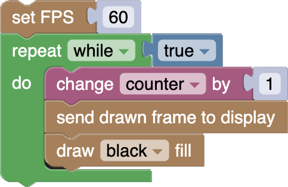

Later in this tutorial, we will be adding many different things to render, check interactions for, move about, and animate. If we are not careful, it's going to get really messy!

For each game "thing" we add, we can wrap up all the blocks for it in a *function*, then just run those blocks wherever we want.

---

Here are some example blocks that show you how you can use functions on a game loop to group blocks that set something up, and also to group blocks that do something in the game loop.

**You don't need to do this step in your game loop, this is just to give you an example!**

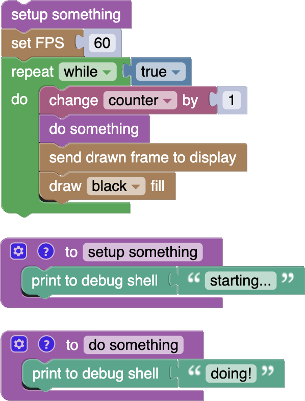
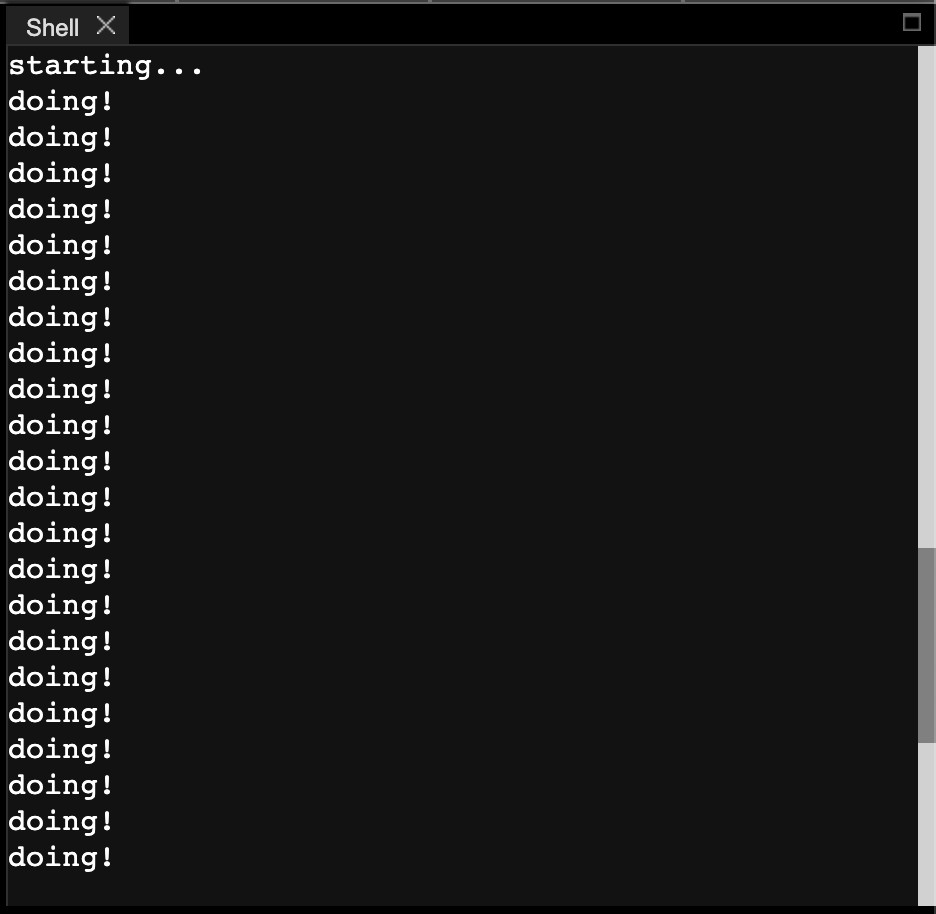

Now that we know a nice and organized way we can add things, let's get started!

---

## Drawing With Shapes

The **Graphics** category in the toolbox has some blocks that help you draw shapes. You can draw lines, outlines of rectangles and squares, and also solid rectangles and squares!

---

### Lines

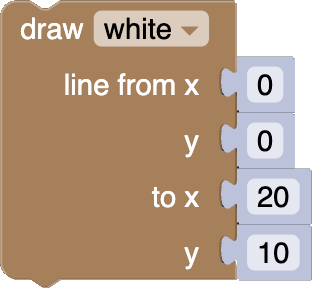

The block above will draw a line between two locations on the screen, by being given the x and y position of both locations.

---

* First, make a "**do line**" function.
* Make it draw two horizontal lines from the middle of both ends of the screen.
* Put "**do line**" inside your game loop.

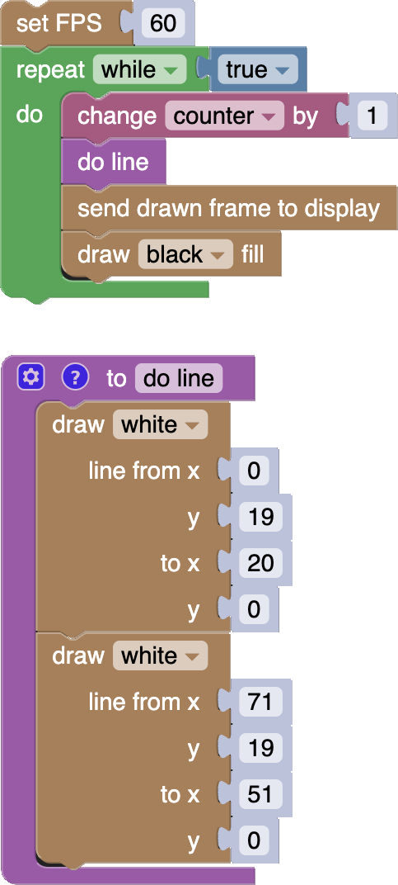
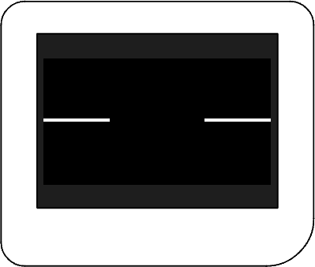

---

### Changing Proportions

Now let's get ready to be able to easily change the width of the lines.

* Create a new variable called "**lineWidth**".
* Make a "**setup line**" function and add it before your game loop starts.
* Set "**lineWidth**" to "20" inside the "**setup line**" function.

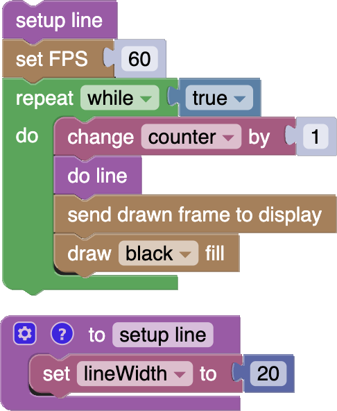

---

Next, let's make the lines respect the "**lineWidth**" variable, and also make the lines move! The update to "**lineWidth**" won't actually change anything, but it will allow us to make it shrink later in the tutorial!

To animate the lines, we will use some maths to make the y position of the end of each line move vertically across the screen, and then, when it reaches the end of the screen, make it wrap around to the other side. We will make the first line scan downwards, and the second line scan upwards. We can use the "**counter**" variable to drive the animation, and we can divide it by 10 to slow it down.

* Update your "**do line**" function so that it respects "**lineWidth**", and animates the lines:

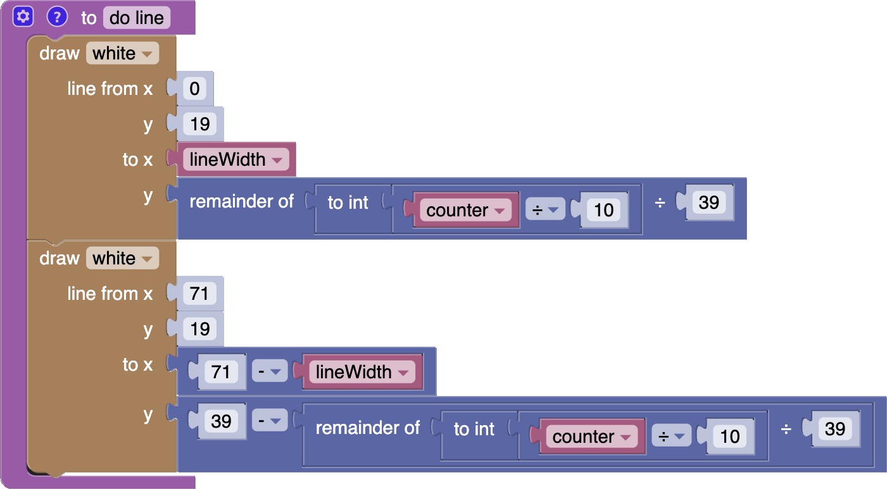

Try changing "**lineWidth**" and see what happens!

---

### Rectangles & Squares

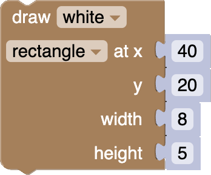

The block above will draw the outline of a rectangle (or square) with it's top left corner starting at a given x and y location. The rectangle will be drawn with the given width and height.

---

Let's use a rectangle to draw a border around the screen!

* Make a "**do border**" function and add it inside your game loop after "**do line**".
* Make the "**do border**" function draw a rectangle around the whole screen.

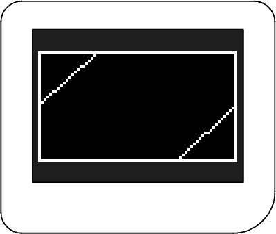

Neat!

---

### Filled Rectangles & Squares

The  block can also draw a solid (filled) rectangle, rather than just an outline! All you need to do is change the "**rectangle**" dropdown to "**filled rectangle**".

---

Let's use a filled rectangle to draw a box that randomly flips around the screen.

First, let's make a box, and set it up so that it can move:

* Make a "**setup box**" function, and add it before your game loop starts.
* Inside "**setup box**", make a new "**boxX**" variable set to 30, and a new "**boxY**" variable set to 0.
* Make a "**do box**" function, and add it inside your game loop, after "**do border**".
* Inside "**do box**" draw a **filled rectangle** starting at the x and y position given by the variables "**boxX**" and "**boxY**", and with width 6 and height 4.

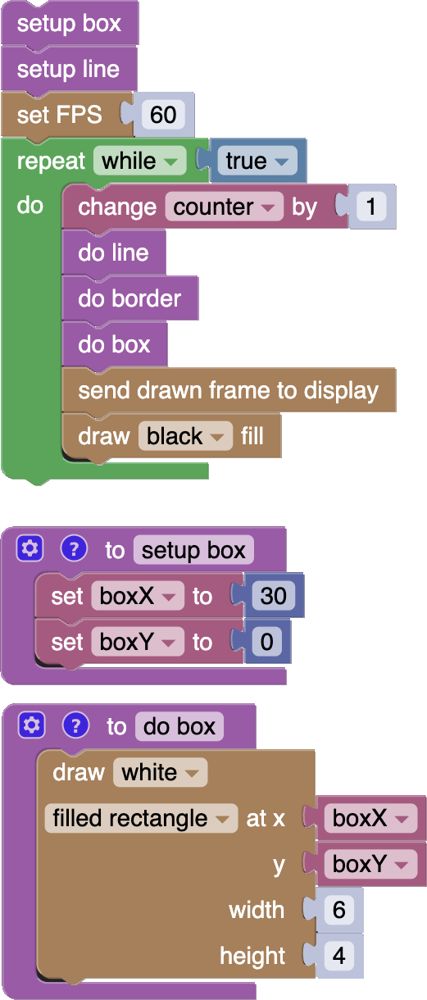
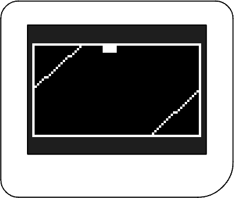

---

### Moving in Random Steps

Next, let's move the box about randomly!

We are going to make the box shift in different directions. First we use a random number between 0 and 1 to decide the direction, vertically (0) or horizontally (1). Based off that, we will move the box in the chosen direction by shifting either "**boxX**" or "**boxY**" the width or height in either direction, or not at all.

---

### If Else

To do this, we will use a  block, which gives you two mouths for blocks. The "do" mouth runs all the blocks when the condition is true, but we also have the "else" mouth, which will run blocks when the condition is ***not*** true.

To make a  block, first make a  block, and then use the settings  button to transform its shape.

---

We will also need to make sure that both "**boxX**" and "**boxY**" are constrained so that the whole box fits within the screen.

* Make a  block inside the bottom of your "**do box**" function.
* Add a conditional which checks if a random number from "0" to "1" is "1".
* Inside the "do" mouth, change "**boxX**" by a random integer from "-1" to "1", multiplied by "6".
* Inside the "else" mouth, change "**boxY**" by a random integer from "-1" to "1", multiplied by "4".
* At the bottom of the "**do box**" function, set both "**boxX**" and "**boxY**" to themselves constrained so that the box stays within the screen area.

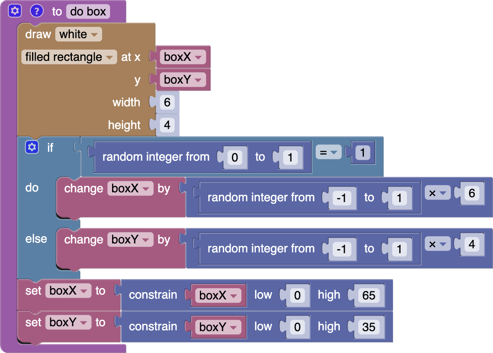

Look and that box dance! That's fast!

---

### Changing Speed

Maybe that's too fast...

Lets slow it down!

Because the "**do box**" function runs during every frame of the game loop, the box moves on every frame too! It's nice how the box moves in steps, so we aren't going to shorten the distance the box moves each frame, instead we are going reduce how *often* the box moves.

We still need to draw the rectangle on every frame, but we are going to make it so that the box only moves every 20th frame.

---

### Return 

To do this, we are going to use a  block from the **Functions** category. Usually, when a function runs, it runs ***all*** blocks, from top to bottom. The  block lets you leave the function half way down, if a particular condition is true. Don't worry about how this block has two plugs inside it, when you add it to your "**do box**" function, the second plug will automatically disappear!

---

Let's make the "**do box**" bail out before it moves the block, if it is anything other than every 20th frame:

* Add a  block right after where it draws the rectangle.
* Make the condition be true when the remainder of dividing the "**counter**" by 20 results in anything other than "0".

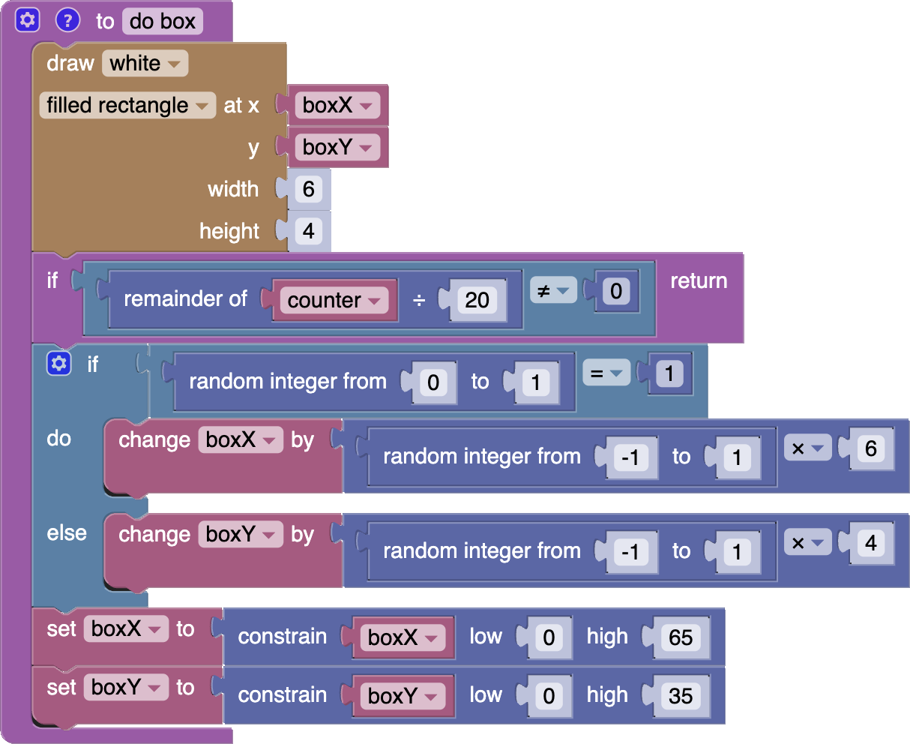

Now that's a more sensible speed!

---

## Animating Sprites

Let's make sprites move too!

---

### Sprite Movement and Orientation

Shapes aren't the only things that can be moved! Sprites can also be moved around the screen, and can even have their pictures mirrored and flipped!

Take a look in the **Sprites** category of the toolbox. In it, you will find the following blocks which allow you to move and reorient sprites:

*  - move the sprite to a new horizontal position.
*  - move the sprite to a new vertical position.
*  - shift the sprite left (negative) or right (positive).
*  - shift the sprite up (negative) or down (positive).
*  - flip the sprite's image upside down.
*  - mirror the sprite's image left to right.
*  - get the current x or y position.
*  - get whether the sprite was flipped (or mirrored) from its original orientation.

---

Let's use this to add a "**kite**" sprite to our game, which bounces around the screen and always points in the direction it's moving:

* Download this image to use for the sprite:

 *Kite Sprite Pointing Up/Left 8x8*

* Make a "**setup kite**" function and a "**do kite**" function".
* Add "**setup kite**" to run before your game loop, and add "**do kite**" to run inside your game loop just after "**do box**.

It should look like this:

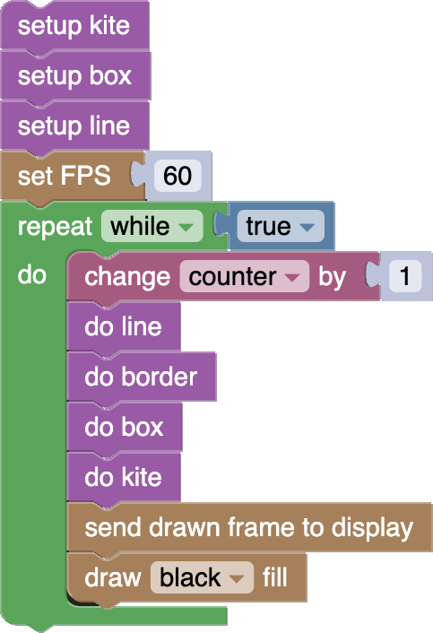

---

* Create a new variable "**kiteDirectionX**", (this will have a value of -1 for left, and 1 for right).
* Create a new variable "**kiteDirectionY**", (this will have a value of -1 for up, and 1 for down). This will combine with "**kiteDirectionX**" to create diagonal movement.
* Inside the "**setup kite**" function, do the following:
    * Create a new "**kite**" Sprite, and load the downloaded kite picture.
    * Move "**kite**" to a starting x position of "64".
    * Move "**kite**" to a starting y position of "32".
    * Set "**kiteDirectionX**" to a starting value of "-1".
    * Set "**kiteDirectionY**" to a starting value of "-1".

It should look like this:

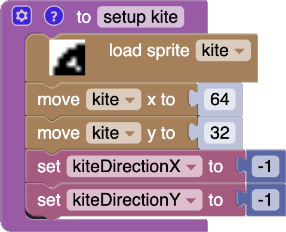

---

* Inside the "**do kite**" function, do the following:
    * Draw the "**kite**" Sprite!
    * Bail out of (return from) the function early if the counter is not divisible by "4" (this slows down the kite to a quarter of full speed).
    * Move the x position of "**kite**" by the value of "**kiteDirectionX**".
    * Move the y position of "**kite**" by the value of "**kiteDirectionY**".
    * Check if **kite** has gone off screen to the left and, if it has, change the "**kiteDirectionX**" to "1", then mirror the image of "**kite**".
    * Check if **kite** has gone off screen to the right and, if it has, change the "**kiteDirectionX**" to "-1", then mirror the image of "**kite**".
    * Check if **kite** has gone off screen at the top and, if it has, change the "**kiteDirectionY**" to "1", then flip the image of "**kite**".
    * Check if **kite** has gone off screen at the bottom and, if it has, change the "**kiteDirectionY**" to "-1", then flip the image of "**kite**".

It should look like this:

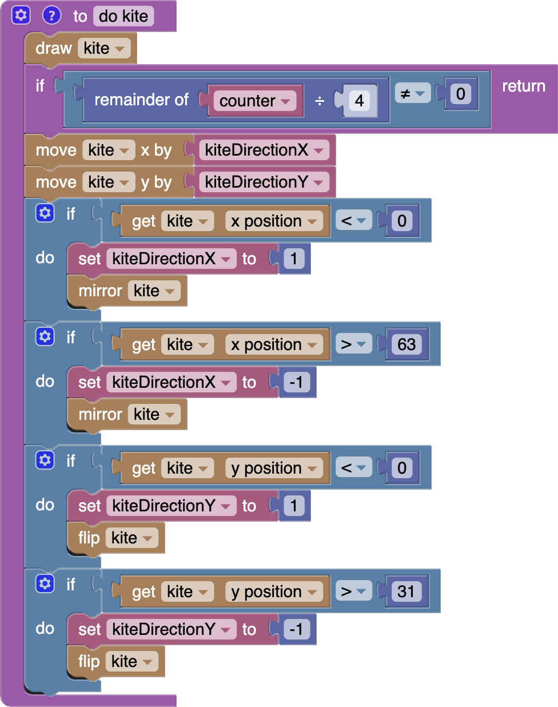

Now you know how to move Sprites around the screen and also how to flip and mirror the image!

---

### Flip Book Animations

Sprites can also be animated like a gif!

Animated sprites have multiple frames inside that can be switched. This can be used to make animations with a <a href="https://en.wikipedia.org/wiki/Flip_book" target="_blank" alt="Flip book wikipedia page">**flip book effect**</a>.

---

#### Animated Sprites

To create an animated Sprite, you can use the **Bitmap Builder**, but instead of drawing one picture, you draw all the different frames of an animation one after another. Animated sprites can be any size, but the frames of an animated sprite must all be the same size.

Here is an example of an animated sprite that makes feet go back and forth like they are walking:

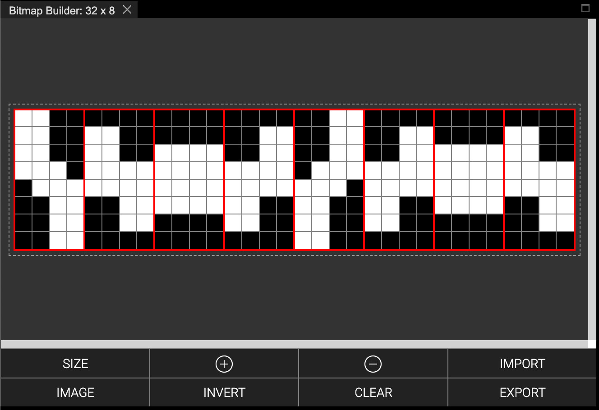

The red boxes in the above image are to help show each different frame in this animated sprite; you won't see the red lines in the **Bitmap Builder** itself.

---

When you load an animated sprite into your workspace, you must use the  block, instead of the  block, and you must specify the number of frames you have in the animated sprite.

Here is our example loaded with its "8" frames set correctly:

If you set this correctly, you will have a sprite that initially draws the first frame, and which has a width and height of **one frame** of the animation, rather than all the frames in the line:

Once you have an animated sprite loaded, you can then switch which frame it draws! Use the  block to switch which frame is drawn. Frame numbers start at 0, and numbers higher than the frame count will wrap around.

To actually play the animation in your animated sprite, you can just increase the frame number by 1 on each cycle of your game loop.

Here is an example of our animated sprite being animated:

**You don't need to do this step in your game loop, this is just to give you an example!**

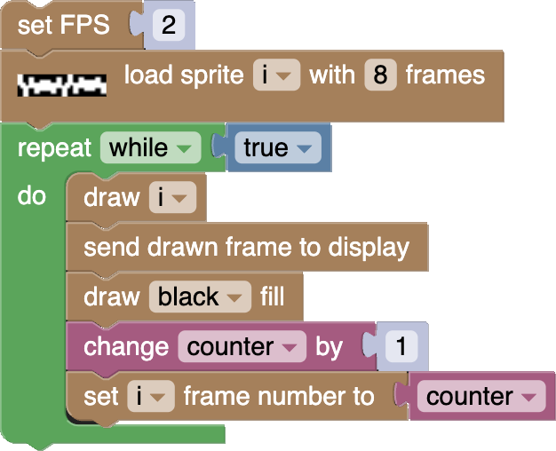

---

Now let's add this animated sprite as a **walker** sprite to our game!

* Download this image to use for the sprite:

 *Animated Walking 4x8 Sprite with 8 frames*

* Make a "**setup walker**" function and a "**do walker**" function".
* Add "**setup walker**" to run before your game loop, and add "**do walker**" to run inside your game loop just after "**do kite**".

It should look like this:

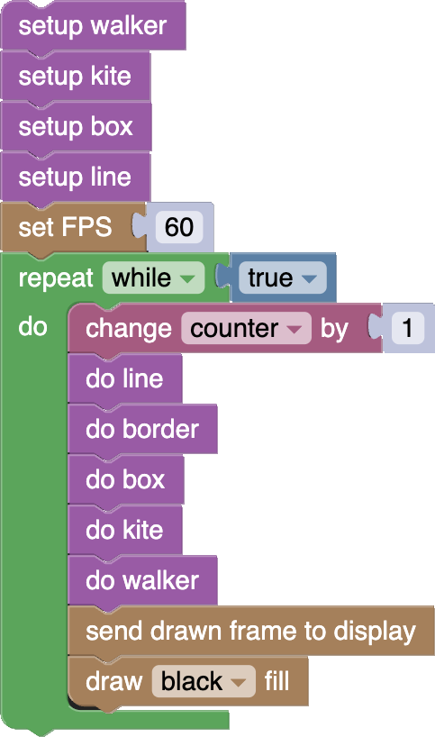

---

* Inside the "**setup walker**" function, do the following:
    * Create a new "**walker**" sprite with a  block, and load the downloaded walker animation onto it.
    * Update the frames count to "8".

It should look like this:

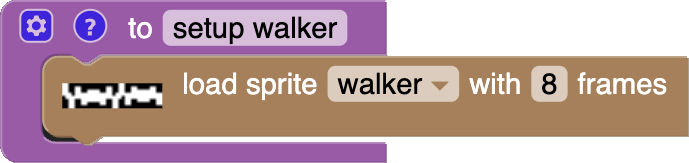

---

Let's make the "**walker**" sprite walk up the screen from the bottom, and when goes off the top of the screen, make it wrap around to the bottom, starting at a new random horizontal position.

* Inside the "**do walker**" function, do the following:
    * Draw the "**walker**" sprite!
    * Bail out of the function early if the counter is not divisible by "4" (this slows down the walker to a quarter of full speed).
    * Increase the "**walker**" frame number by 1, by using a  block (from the **Sprites** category) to get the current frame number from "**walker**", then adding 1 to it before setting it back as the new frame number.
    * Move the y position of "**walker**" by -1 (upwards).
    * Check if the "**walker**" has gone entirely off the top of the screen and, if it has, move it back to a y position of 47 (entirely off the screen at the bottom) and also give it a new random horizontal position.

It should look like this:

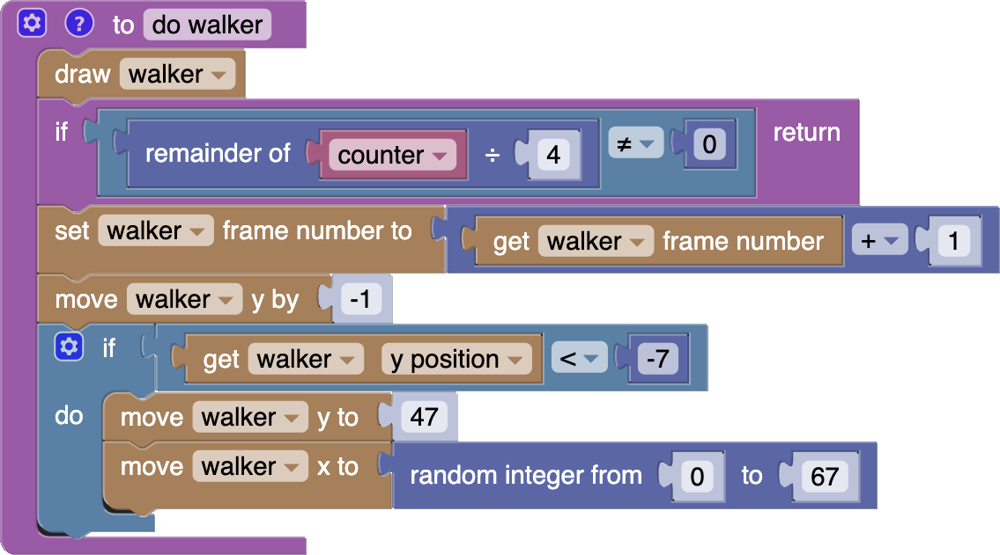

Nice!

---

### Switching Frames

Animated sprites can do more than just flip-book animations like a gif does, frame-by-frame. You can also control switching frames in other interesting ways!

---

### Movable Sprite Character

It's about time we added a player character to this game! In the process, we will learn how to animate sprites in a different way.

Let's make a movable bird that the player can control and that stays within the screen area. The bird will be able to move in any direction, but it will only be able to face left or right. We can use a  block to **mirror** a sprite to look in the other direction.

Let's also make the bird open a mouth at the front whenever either 🔴 button is pressed.

We can use *animated sprites* for that, and have the first frame be the bird normally, and have the second frame be the bird with it's mouth open. Then we just need to change to the second frame whenever either 🔴 button is pressed!

---

Let's get started!

* Download this image to use for the sprite:

 *Bird 8x7 Sprite with 2 Frames*

* Make a "**setup bird**" function and a "**do bird**" function".
* Add "**setup bird**" to run before your game loop, and add "**do bird**" to run inside your game loop just after "**do walker**".
It should look like this:

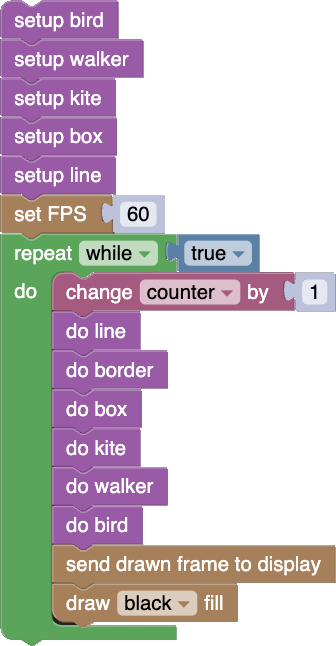

* Inside the "**setup bird**" function, do the following:
    * Create a new "**bird**" sprite with a  block, and load the downloaded bird frames onto it.
    * Make sure the **frames** count is set to "2".
    * Move the x position of the "**bird**" to a starting position of "32".
    * Move the y position of the "**bird**" to a starting position of "18".

It should look like this:

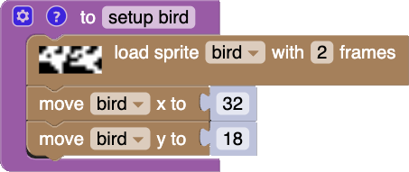

---

Next, let's draw the "**bird**" sprite and make it open its mouth whenever either  🔴 button is pressed:

* Inside the "**do bird**" function, do the following:
    * Draw the "**bird**" sprite!
    * Set the frame of the "**bird**" sprite to be "1" if button A or B is held, and "0" otherwise.

It should look like this:

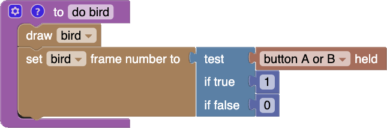

---

#### Controller Movement

Finally, let's make the "**bird**" sprite move with the direction controls, making sure to mirror the bird as it faces left or right:

* Add the following to the inside of the "**do bird**" function:
    * Bail out of (return from) the function early if the counter variable is divisible by "3" (this slows down the bird to two thirds of full speed).
    * If up is held, move y by "-1".
    * If down is held, move y by "1".
    * If left is held, move x by "-1", and also, if the "**bird**" is currently mirrored, mirror it back.
    * If right is held, move x by "1", and also, if the "**bird**" is not currently mirrored, mirror it.
    * Constrain the y position to within the screen vertically.
    * Constrain the x position to within the screen horizontally.

It should look like this:

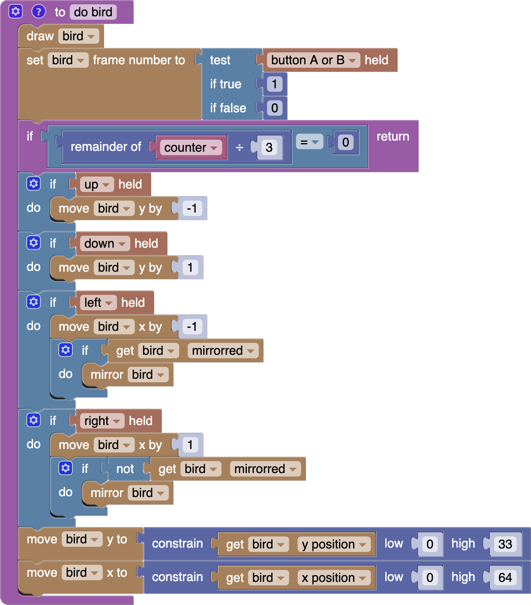

---

## Sprite Transparency

You may have noticed from the last video above, that none of the sprites have any **transparency**. This visually makes their whole rectangle of dimensions draw black over anything underneath. **Transparency** is when you can see through parts of a picture. You can see that the bird, kite, and walker don't have transparency when they go over the rectangle border.

There are two ways to add transparency to sprites.

One way is by selecting either black or white to be the transparent color.

The second way allows you to draw white, black, and also transparent pixels. To paint those transparent pixels, you use a second sprite, with white being the pixels of the first sprite to draw, and black being the pixels to leave transparent. This second sprite is called a *Sprite Mask*.

---

### Transparency By Color

First, let's give both the kite and the walker some transparency by setting "black" to be their transparency color. We can do this by using a  block:

* Inside your "**setup walker**" function, set the transparency of the "**walker**" sprite to "black":

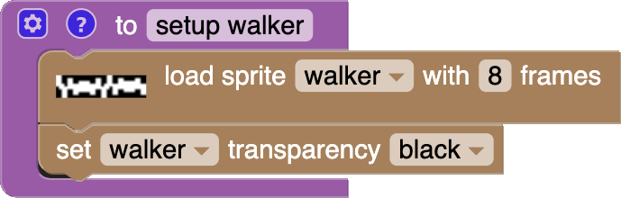

* Inside your "**setup kite**" function, set the transparency of the "**kite**" sprite to "black":

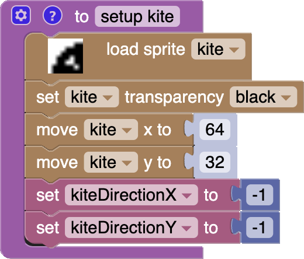

It should look like this:

Better!

---

### Transparency By Mask

For the "**bird**" sprite, it would be nice if it had a thin black border around it to make it easier to see if its edges are over something like the border. We don't want the full sprite rectangle, just a thin border. So we want white, black, and also transparent pixels.

For this, we will use a *Sprite Mask*. A *Sprite Mask* controls the drawing of another sprite by having white pixels indicate that the same pixel in the main sprite should be drawn.

So we are going to need a *Sprite Mask* for the bird. This will be similar to the "**bird**" sprite but with the eye filled in white and extra pixels around it also filled white, so they get drawn. To match with the bird, this sprite will also have 2 frames.

---

First, let's get the sprite mask loaded and ready for drawing:

* Download this image to use for the sprite:

 *Bird Mask 8x7 Sprite with 2 Frames*

* Inside your "**setup bird**" function, also do the following:
    * Load the downloaded Sprite as a new Sprite called "**birdMask**".
    * Make sure the frames count is set to "2":

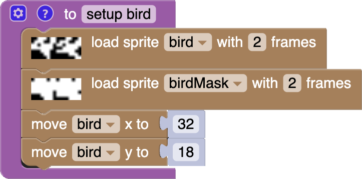

---

Next, let's apply the "**birdMask**" as the mask when drawing the "**bird**" sprite. We can do this by using a  block from the **Sprites** category.

* Replace the  block inside the "**do bird**" function with a  block.
* Ensure the drawn sprite is still set to "**bird**".
* Set "**birdMask**" as the mask sprite to apply.

We must also remember to change the frame of the "**birdMask**" sprite, just like we are with the "**bird**" sprite. We can do that by simply setting the "**birdMask**" frame number to be whatever the frame number is for the "**bird**" sprite.

You can see both changes here:

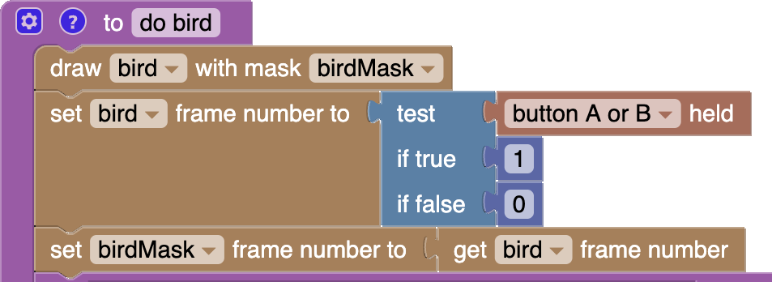

It should look like this:

We now have sprites with both kinds of transparency in our game!

Pretty!

---

## Working with Pixels

Let's see what we can do with individual pixels!

---

### Drawing Pixels

You can also draw individual pixels, one at a time!

The  block from the **Graphics** category, will draw a pixel at the given x and y position.

---

Let's draw a pixel to make a bullet that the bird can shoot!

The bullet will be able to shoot in either a left or right direction, depending on which way the bird is facing when it shoots. It should shoot out at the mouth position of the bird. It won't actually hit anything yet, but we can get started drawing it!

* Make a "**setup bullet**" function and a "**do bullet**" function".
* Add "**setup bullet**" to run before your game loop, and add "**do bullet**" to run inside your game loop just after "**do bird**".

It should look like this:

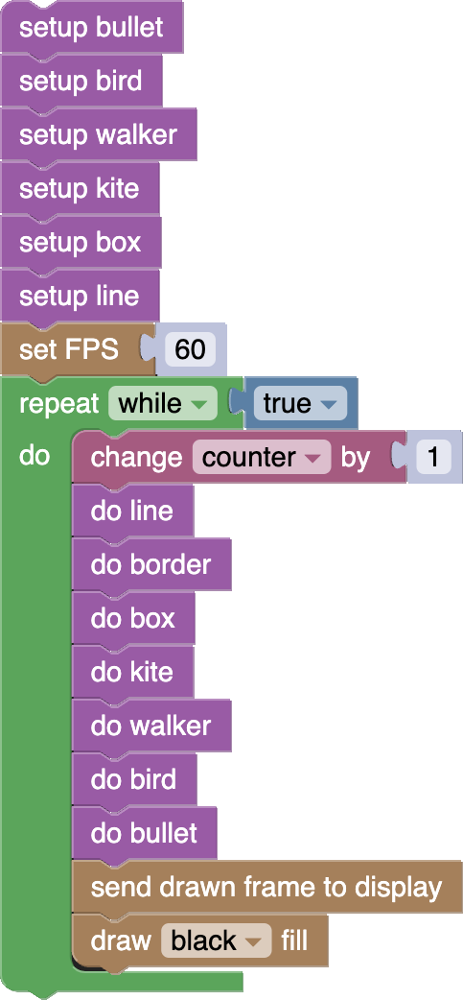

---

* Create a new variable "**bulletDirection**", (this will have a value of -1 for left, and 1 for right).
* Create two new variables for the bullet position, "**bulletX**" and "**bulletY**" (these will start off-screen).
* Inside the "**setup bullet**" function, do the following:
    * Set "**bulletDirection**" to a starting value of "1".
    * Set "**bulletX**" to a starting value of "-99" (or any other value off-screen).
    * Set "**bulletY**" to a starting value of "-99".

It should look like this:

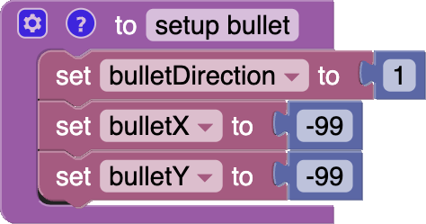

---

* Inside your "**do bullet**" function, do the following:
    * Use a  block to draw a pixel with x and y positions being the values of the "**bulletX**" and "**bulletY**" variables.
    * Move the bullet by changing the the "**bulletX**" variable by the "**bulletDirection**" value.
    * If button A or B is hit, launch the bullet by doing the following:
        * Set the "**bulletDirection**" to "1" if the "**bird**" is mirrored, otherwise "-1".
        * Set "**bulletX**" to the x position of the "**bird**".
        * Set "**bulletY**' to the y position of the "**bird**", plus 3 (to come out of the mouth).

It should look like this:

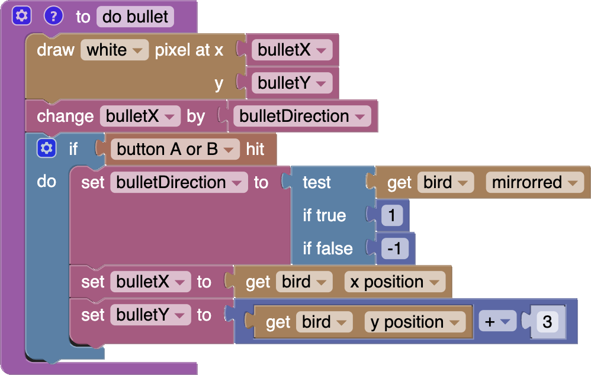

Pew! Pew!

---

### Collision Detection with Pixels

Now we just need to do some interactions like making the bullet hit things!

For this we can use the  block from the **Graphics** category. Which checks a given x and y position, and gives **true** for "white", and **false** for "black". We can use this to check if a drawn location on the screen is white or black.

We can detect if a bullet hits something by checking if its location is already white, before it is drawn!

---

Let's make the goal of this game to destroy the lines on either side of the screen. If the bullet collides with either line, we can shrink the lines, and if the lines disappear, the player wins!

* In your game loop, immediately after "**do line**" draws the lines, use a  block to check if the bullet position is white (this means they must have been drawn by the lines). If it is, change the "**lineWidth**" variable by "-1" to shorten them.
* Also check if the "**lineWidth**" is "0" and, if it is, display "YOU WIN!", wait "3" seconds, and then reset:

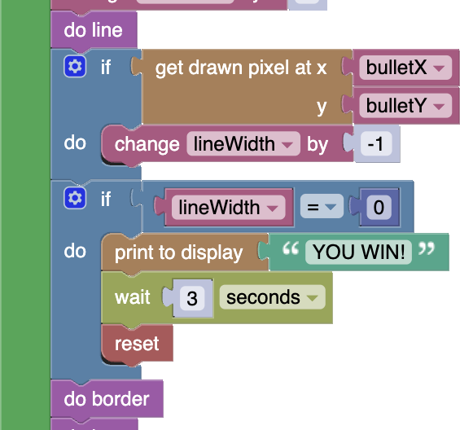

---

Next let's make it so the bullet disappears if it hits anything except the bird:

* In your game loop, just before the bird is drawn by "**do bird**", check if the bullet pixel is already drawn and, if it is, set "**bulletY**" to "-99", so it moves off screen:

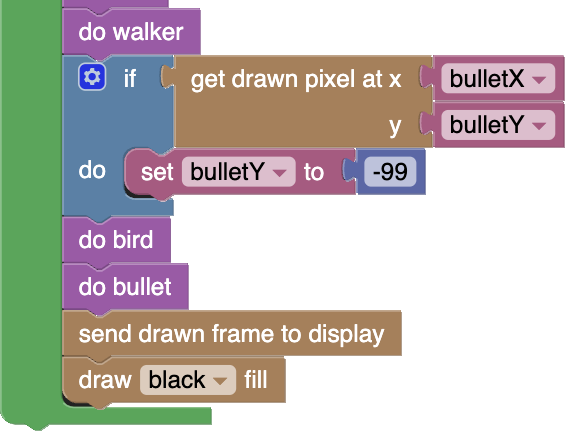

---

Now let's make the challenge of this game to be avoiding all the shapes!

Before we draw the bird, we can check if the center pixel of the "**bird**" is already drawn, or filled by another sprite, and if it is, we can GAME OVER!

* In your game loop, just before the bird is drawn by "**do bird**", check if the pixel at the center of the bird is already drawn and, if it is, display "GAME OVER!", wait "3" seconds, and then reset:

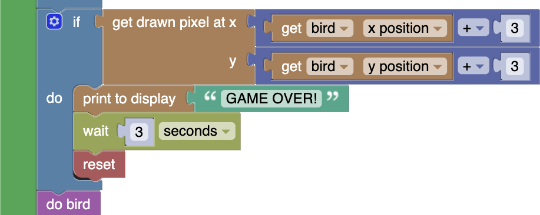

What a fun game! 

---

## All Combined

Here are the blocks for all of the different game components and sprites - there are lots of blocks, so it's great that they were organized using functions:

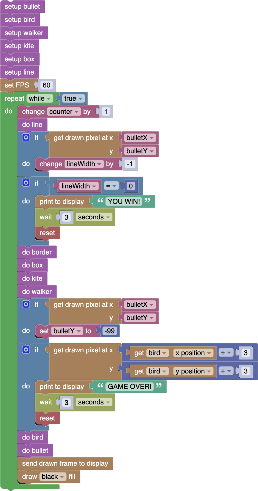
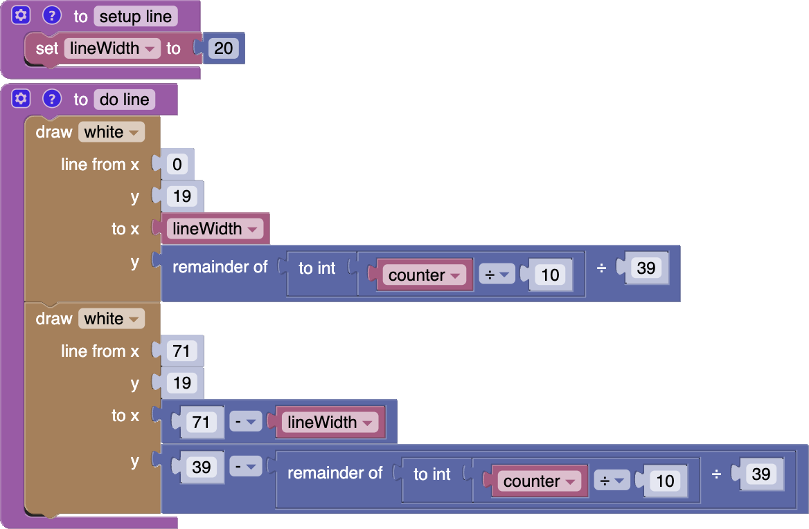
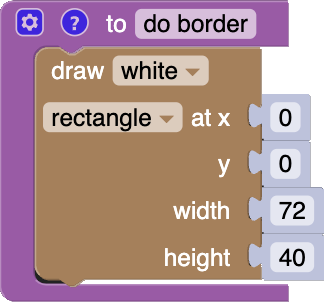
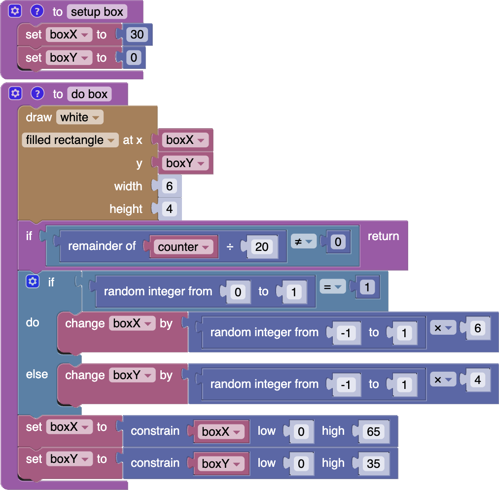
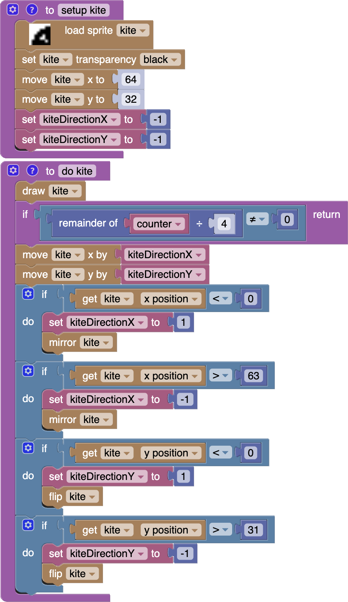
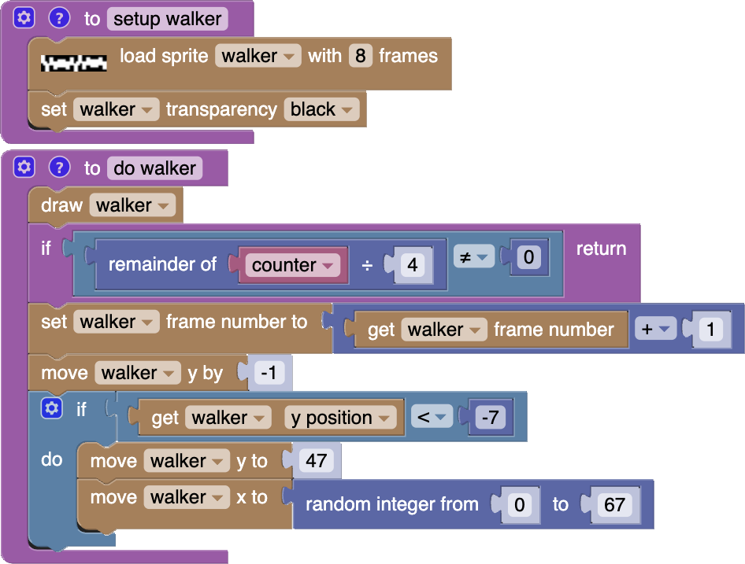
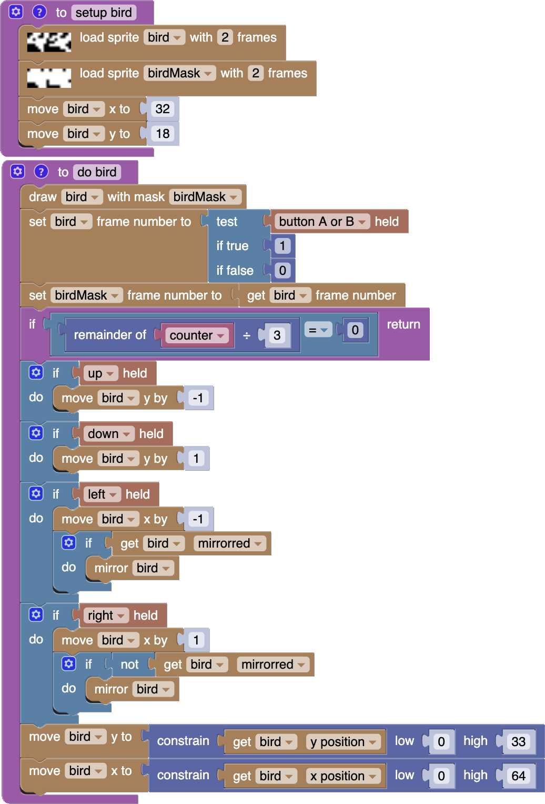
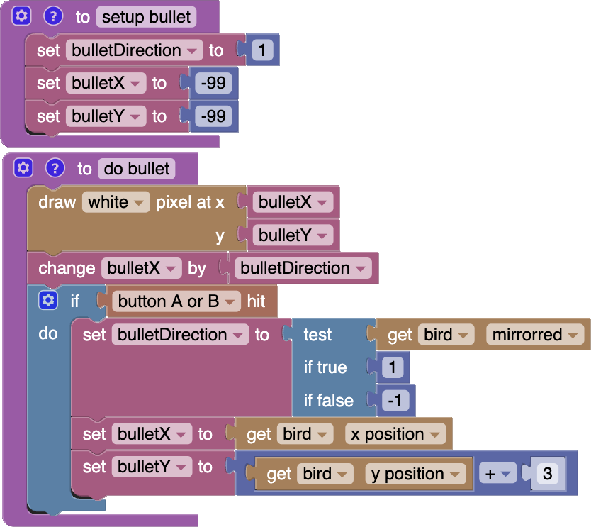

You can download all [**the GeoBlitz example blocks here**](GeoBlitz.blocks).

---

[**Next Tutorial: Working with Fonts**](../Working-With-Fonts/)
