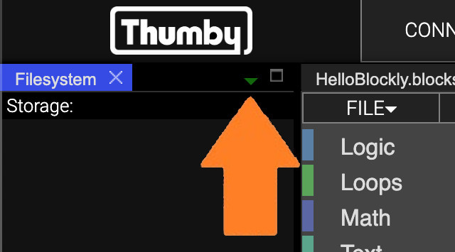

# Making Sprites

It's time to paint some pictures, and load them into your game!

This tutorial will introduce you to:

* Sprites in the Thumby Code Editor
* How to load sprites into your Blockly workspace
* How to display sprites in your game
* This tutorial won't yet show you how to move them around in your game.

---

Let's get started!

Games sometimes have title screens that display the name of the game, and maybe a picture, just before the game loads. Adding a title screen can be a nice way to make a game more pretty and have more character.

We are going to make a title screen for a game (actually for the one we made in the [**previous tutorial**](../Simplest-Game/ "Making a simple game on Thumby with Blockly tutorial")), and show it on-screen briefly by making and displaying a sprite.

---

Sprites are pictures that you can hand-draw, or load from a picture file. You can display these in your game and move, flip, mirror, and even make animations with them! For this tutorial, we are going to make a sprite that fills the whole screen and display it for a few seconds.

---

## Drawing Sprites

First let's make a sprite!

* Grab a  block from the **Sprites** category, and place it into an empty part of your workspace above any other blocks you might have in your workspace.

Putting it higher up makes it run first.

We now have a sprite in our workspace that has been given a default name. Let's change it to something better.

* Right click on the dropdown at the end of your  block and click on "**Rename Sprite**".
* Give it the name "**title**".

---

Now let's display it on-screen. First, we need to draw it in the next frame, then we need to send the frame to the display.

* Grab a  block from the **Sprites** category and add it underneath your load sprite block.
* Now add a  combo block underneath that.
* After that, add a  block from the **Flow** category to make sure the sprite shows on the display for a while. Change the value from "1" to "3" so the sprite shows on the display for 3 seconds.
* Run it:

Sweet!... Wait... Where did that picture come from? All sprites are initialized with a default drawing of Thumby. That is what you are seeing!

---

**⚠ Note**: *Be careful when you delete  blocks, as the picture data they contain will be lost! You can keep a copy of them in the corner of your workspace just to be safe!*

Our next step is to change the picture!

---

## The Bitmap Builder

Sprites can have their pictures changed using the [**Bitmap Builder Widget**](../../Code-Editor/Widget-panels/#bitmap-builder).

Let's find the Bitmap Builder. It might be next to the Filesystem tab:

Or it might be in the hidden-tab dropdown:

Or you might need to open it again with **UTILITIES** -> **WIDGETS** -> **+ BITMAP BUILDER**.

---

Once you have found it, it should look like this:

---

### Loading Sprites To The Bitmap Builder

To load a sprite from your workspace into the Bitmap Builder, you use the **IMPORT** button, but the Bitmap Builder needs to know which Sprite you want to open (you might have more than one), so you must make sure a  block is selected in your workspace.

* Select the  block in your workspace for the "**title**" Sprite.
* Click **IMPORT**.

You should see the Thumby Sprite loaded:

---

### Updating Sprites on the Workspace

First, let's make some changes to the sprite picture, then update the sprite back on our workspace:

* Click **INVERT** which will swap the colors.
* Make sure the  block in your workspace is still selected.
* Click **EXPORT**.

You should see that the pictures in the  blocks update:

Nice!

* Now run it!

Title screens look best when they fill the whole screen and when they have been customized for the game. Let's do both next.

---

### Using the Bitmap Builder to Paint

First, let's make the sprite the same size as the screen. The Thumby screen is 72 pixels wide, and 40 pixels high.

---

#### Resizing Sprites

**⚠ Note**: *Resizing your sprite will clear its contents. Don't resize your picture unless you don't mind losing it, or unless you have stored it back in your workspace.*

In the Bitmap Builder:

* Click **SIZE**.
* Enter **72** for the width and click **OK**.
* Enter **40** for the height and click **OK**.

You should now have a blank white drawing area with lots more pixels!

**⚠ Note**: *The Bitmap Builder has a maximum image size of 144 wide, and 80 tall, which is much larger than the Thumby screen!*

---

#### Drawing

To draw on the picture, use the mouse **Left Click** to draw black pixels, and use **Right Click** to draw white pixels. You can click and drag across the screen to scribble.

If you want to start over, use the **CLEAR** button to reset the whole picture to white.

To zoom in and out of the picture, use the **⊕** and **⊖** buttons.

---

### Opening Image Files From Your Computer

You can use the **IMAGE** button to open files from your computer. They will be automatically converted to black and white. The image file you open must not be larger than 144 wide and 80 high. Most image file formats will work.

* Try downloading the image to your computer and loading it into the Bitmap Builder with the **IMAGE** button. Download this image (Right-click and select 'Save image as...'):

 (Speed Buzzer Title Sprite 72x40)

* Now update the sprite in your workspace with **EXPORT** and then run it in the Emulator with **START** to see what happens!

---

[**Next Tutorial: Drawing and Dynamics**](../Drawing-And-Dynamics/)
