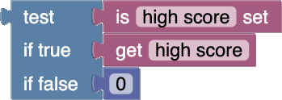
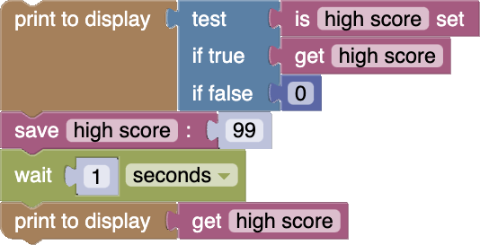

# Saving High Scores

In this tutorial we will show you how to save persistent data on your Thumby, so you can store information like high scores and save game progress for the next time you play.

---

You may have noticed that whenever you restart a game, all the variables and data is reset to their original values. It can be useful to be able to save data that persists even after you power off or restart the Thumby device.

Take a look at the **Saves** category in the Blockly toolbox. In there, you will find blocks that help you save data for things like high scores and save games.

---

## Save Data Blocks

Here are some of the blocks you can use:

*  - A conditional which checks if there was a previous data save.
*  - Retrieve the previous data save.
*  - Save some data.

---

### How They Work

You will notice that all these blocks default to saving a "*high score*" save. This "*high score*" is the name of what you are saving, and "*high score*" is just the example! You can have lots of different kinds of save data by changing "*high score*" to any save name you want!

---

Data that you save with the  block will be retrievable by any  block with a matching save name. It will still be there even after the game restarts!

**⚠ Note**: *Save data won't persist after a restart when running in the Emulator. Save data only persists after restart when running on a real Thumby device, like with **FAST EXECUTE**.*

---

When a game runs, and it wants to retrieve some kind of save game data, it needs to know whether the save data even exists. If it's running for the first time, there won't be any saved data! The  block is helpful for checking if saved data exists.

Here is a group of blocks which will retrieve some saved data, but if it doesn't exist, it will give a default value of 0:

---

## Example

Here is an example set of blocks which will first retrieve any saved "high score", and print it to the display. Then it will update it to 99, wait for a second, then display it again:

It doesn't check if the saved data exists the second time that it gets the saved data, because it just saved that data, so it must exist!

---

### First Run

The first time that you run it, you will see the default 0 value for one second...

... and then the saved 99 "high score" data.

### Second Run

The second time that you run it (if you are running it on a real Thumby device), you will see the saved 99 "high score" data right from the start!

---

[**Next Tutorial: Publish Your Game**](../Publish-Your-Game/)
