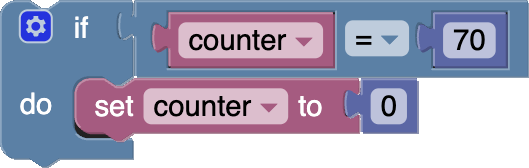
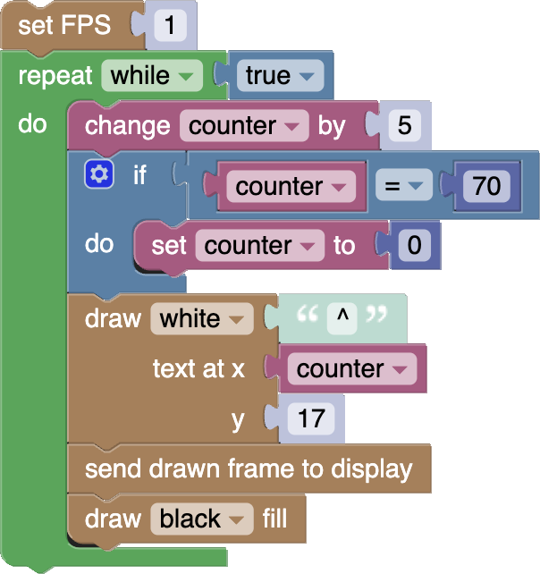

# The Simplest Game

It's time to make your first game!

This tutorial will walk you through creating a very simple (but quite fun) little game. In the process it will teach you a few basics about game development on the Thumby, and get you comfortable placing and arranging all kinds of blocks.

---

Let's get started!

* Clean your workspace so you are starting fresh. You can open a new workspace in a new Blockly editor tab with **FILE** -> **NEW BLOCKLY TAB**.
* Make sure your workspace is set to run in the emulator by checking both **EMULATION: ✅ ✅** checkboxes.

---

## The Game Loop

Most games are built with a set of repeating instructions which keep repeating continuously until the game ends. These repeating instructions follow these main steps:

* Move things around.
* Draw a picture of the moved things.
* Show the picture on the display.
* Repeat these steps again.

These repeating sets of instructions are sometimes called the *main game loop*. It's called a loop because it "loops" over and over again continuously. Each new drawn picture that is sent to the display is called a *frame*. That's where the term *frames per second* (or *FPS*) comes from. Games that run at 60fps will move things around and then send a new drawn frame to the display 60 times every second.

**⚠ Note**: *The display won't actually show what is drawn on a frame until you send the frame to the display. Any block that ends with* "**.. to display**" *will do that for you.*

---

Let's start making our own game loop.

* Place a  block from the **Loops** category into your workspace.

We want the loop to keep running forever, and this *repeat* block only loops while a condition is true. That condition gets put into the little plug after where it says "while". There are all sorts of conditions you can make from blocks in the *Logic* category, but we are going to use the simplest one.

* Take a  block from the **Logic** category, and plug it into the  block in your workspace. It should now look like this:

This sets up a game loop that will keep repeating forever (or until you click **STOP**, or turn off the Thumby). This loop now needs some blocks inside, so that it has something to do each time it loops.

We are going to want to makes some things, move them around, and then draw and display each frame. First, let's draw and show something, and then worry about moving it around afterwards. Let's show a character of text on screen.

---

## Drawing and then Updating the Display

* Take a  block from the **Graphics** category, and place it inside that mouth part of your  block.
* Now change the "Hello World" text in that block to "^".
* Now grab a new  combo block from the **Graphics** category, and connect it underneath the  block, but still inside the mouth of the  block.
* Now see what it does by clicking **START**.

It should all look like this:

All this is doing, is repeatedly drawing the "^" character to the top left position of the frame, then actually showing the frame on the display, and then clearing the next frame to get ready to repeat the whole process again. It may look like that little hat symbol is just sitting there doing nothing, but it is being redrawn many times per second, and it's ready to be moved!

---

## Moving Things Around

Let's try to make it move down.

* Change the "0" in the "y" value of the  block to "17".
* Now run the this again:

Sadly, that just moved its initial position downwards. We really want to animate it. For that we need to change a position value on the  block on each cycle of the repeat loop. We need to increase one of those numbers every frame. Let's see if we can make it animate moving horizontally by changing that x position value. We want to replace that unchanging "0" with something that *varies* every frame. Fortunately, we can use a **Variable** for that. *Variables* act like numbers or text, but they can be changed!

---

We need to create a variable and give it a name.

* Open the **Variables** category and click on the **Create variable...** button at the top.

It should ask you to give the variable a name.

* Call it "**counter**" and click **OK**.

Some new blocks should have automatically appeared in the *Variables* category of the toolbox! These are all the blocks for your new variable called "counter".

---

This counter variable doesn't have any value in the workspace at all... yet! Lets give it a value that increases each frame. The  block can increase the value of the variable by 1 on each frame, and will start it's value at 0 if it hasn't already been set.

* Grab a  block from the **Variables** category and place it inside the mouth of the  block, but this time place it at the top of the mouth, just above all the others that are already inside.

It should now look like this:

---

The value of this variable should now be increasing by 1 every frame, but we aren't using it for anything yet! We want to retrieve the value out of "counter" on every frame, and use it for the x position of the text. The  block from the *Variables* category, allows you to retrieve the current value out of the variable, and use it anywhere you can put a normal number block.

* Take a  block from the **Variables** category, and place it into the x position over the "0" block.

It should now look like this:

If you run this now, and if you watch very closely, you might briefly see that hat character speed along and disappear off screen to the right. That's just going to keep going, further and further offscreen as the "counter" variable increases to infinity.

---

Let's try slowing things down so we can see it clearly.

Previously, I talked about games running at different *frames per second*, but what is our current game running at? Well, we haven't set it, so it's running as fast as the frames can display! This is just too fast! Let's set a frame rate with the  block. Let's slow it way down by setting it to run a only 1 frame every second.

* Grab a new  block from inside the **Graphics** category, and place it above the  block (not inside).
* Change the FPS value from "30" to "1".

It should now look like this:

* Run that and you will see the "^"symbol very slowly move across the screen:

Now things are moving!

---

We've got all the basics for a decent little game loop! We've got some setup logic, a main game loop, with things being moved, frames being drawn, and then the drawn frame being sent to the display! It's just a shame that the "^" symbol eventually disappears permanently offscreen. Let's make it loop back around to the other side, but first let's speed things back up. We could increase the FPS value, but let's try making the "^" symbol move in larger steps instead.

* Change the increment value from "1" to "5" in your  block.

If we ran this now, the "^" symbol would keep stepping forwards 5 pixels at a time, but it would still disappear offscreen. Let's make it wrap around.

Ideally, when the "counter" gets to the end of the screen, we want to reset it back to 0. The Thumby screen is 72 pixels wide, so when "counter" gets to 70 the "^" symbol will be half off screen. So, if the "counter" value is equal to 70, we want to set it to 0.

The  block allows you to *do something* (like set "counter" to "0") on a *condition* (like when "counter" equals 70).

* Grab a new  block from the **Logic** category and place it in an empty area of your workspace. We will move it into position after we have worked on it.
* Grab a new  block from the **Logic** category and place it into the plug next to the "if" on the  block.
* Grab another  block from the **Variables** category, and place it in the the first hole of the  block.
* Grab a new  block from the **Math** category and place it in the second hole of the  block.
* Change the "123" to "70".

It should now look like this:

* Grab a new  block from the **Variables** category, and place it inside the mouth next to where it says "do".
* Grab another  block from the **Math** category and plug it into the end of the  block.
* Change the "123" to "0".

It should now look like this:

This collection of blocks will reset the "counter" back to 0 whenever the "counter" gets to 70! Now it just needs to go into our main game loop so that it runs every frame.

* Place the newly made collection of blocks into the  main game loop, between the  block and the  block. You can drag all the blocks together by moving the  block, which holds them all together.

It should now look like this:

* Run that and see it wrap around!:

Nice!

---

## Adding More Things

You can add lots of different things to your game. As an example, let's add an "X" character and put it at the far right of the screen just above where the "^" symbol wraps around.

* Create the following highlighted block and add it to your loop. It should be easy enough with everything you have learned so far!:

---

## Random Numbers

Some games take advantage of random numbers to make things different each time you play them. Some games are different each time because of how the player chooses different options each time they play, like in chess, but sometimes it's nice to add a little bit of chance! You can also use random numbers to draw things in more interesting ways.

That "X" symbol is looking a little bit dull. Let's make it dance! It currently sits there at x position 65, but it would be nice if it randomly moved about across positions 64 to 66.

* Take a  block from the **Maths** category, and plug it into the x position plug on the block that draws the "X", replacing the "65".
* Change the "1" to "10" values and make them "64" to "66".
* Run it and watch the "X" jump around a little!

---

## Button Actions

We've made a fun little animation, but there isn't any player interaction. It would be really nice if pressing a button does something! Let's try to make the game speed up every time the player presses one of the red 🔴 buttons.

Take a look in the **Buttons** category of the toolbox. In it, you can see two collections of blocks, with each collection of blocks having a block for each button. Each button has a "held" block () and also a "hit block" (). Both of these blocks act as *condition* blocks, and give a value of **true** whenever something happens with the buttons.

The *condition* behavior of the *held* blocks are slightly different to the *hit* blocks:

* **held** button blocks are true **for the entire time** a button is held down.
* **hit** button blocks are true **only once** each time a button is pressed, even if the button is held down for a long time.

The difference is important because a button can be held down while multiple game loops cycle through. Actually, when games run at high frame rates, that is normally always the case!

Let's make the game speed up each time one of the 🔴 buttons is pressed, so let's use a () "hit block"!

Once again, we want to *do something* if a *condition* is true, so:

* Grab another  block and place it inside the bottom of your game loop.
* Grab a new  block from the **Buttons** category and place it into the "if" plug.
* Grab another  block, and place it inside the "do" mouth.

Each button block can have it's trigger button changed by using the dropdown inside the button. In there, you can find some additional options like "dpad", which will activate when *any* direction button is pressed. We can change this dropdown so that our button block activates when *either* button A or button B is pressed.

* Change the dropdown in the  block from "button A" to "button A or B".
* Run it and then press one of the buttons and watch it speed up!

Wow, that's fast!

---

Let's change it so that the game speeds up *gradually* every time the button is pressed. We want to increase the FPS value by 1 every time the button is pressed, similarly to how we increased the "counter". Unfortunately, there is no increment block for the FPS, so we are going to have to do the maths ourselves.

We want to retrieve the current FPS value, add 1 to it, then set that as the new FPS value. The  block retrieves the current FPS value, and can be used anywhere where a number block is allowed to be placed, and the  block allow you to do basic maths like addition, subtraction, and multiplication. We can also place a  block inside a  block, giving a value of 1 more than the current FPS value!

* Grab a new  block from the **Maths** category, and place it in the value plug of the  block, replacing the "30".
* Grab a new  block from the **Graphics** category, and place it into the first value plug if the  block, replacing the first "1".

Sweet!

---

## Making a Challenge!

This looks pretty cool, but it could be a lot more **fun**. Games are most fun where there is some kind of challenge! Games usually have some kind of *goal* that takes effort or skill to achieve.

Let's make the *goal* be making the "^" symbol move as fast as possible, but let's make the *challenge* that it only goes faster when the button is hit exactly when the "^" symbol is underneath the "X" symbol, and if the button is hit at any other time, it goes back to its original slow speed!

To do this, we can leave it always increasing the speed when the button is hit, but if the button is hit when it is in the wrong position, we reset the FPS back to 1 frame per second:

* Grab another  block and place it inside the "do" mouth that activates when a button is hit, just below where you increase the FPS.

Notice that you can put  blocks inside of each other!

This runs when the button is hit, and is where we are going to reset the FPS if the "^" is in the wrong position.

You already have a combination of blocks that checks the position of the "counter" where it wraps around to the left when it goes of screen. That is in the "if" plug up at the top of your game loop.

* Copy (**Ctrl+c**) the condition out of the "if" plug at the top of your game loop, then paste (**Ctrl+v**) and move it into the new "if" plug.

We want this condition to activate when the "^" symbol is underneath the "X" symbol instead of when it has gone off screen so we need to change the position where it activates:

* Change the "70" in the newly made condition to "65".

We actually want it to activate when it is in any *other* position than at position 65:

* Change the "=" in the dropdown of the condition to "≠".

Now we want to reset the FPS back to 1 whenever that activates:

* Copy the block where you initially set the FPS to 1 just above your game loop, then paste and move it into the new "do" mouth.

Have a play and try to get the "^" symbol to go as fast as you can without missing the "X"!

---

## Adding Sounds

Sounds are a great way to make your game have a more interesting experience. Little beeps can go a long way! They can also be a part of how the game works.

It would be really nice to have a quick little beep every time the "^" symbol moves, and have the beeping go faster as it moves faster. That could help players get into the rhythm of this game!

It's would also be nicer if you immediately knew when you missed the "X", rather than only knowing after seeing the "^" slow down. A long beep that stops the game for a bit would help with that.

Take a quick look in the *Audio* category of the toolbox. There are two main blocks that make sounds. One will trigger a sound playing in the background while continuing the game loop, and the other will pause the game loop until the sound finishes playing.

Both sound blocks take two values. The first is the tone. Higher tone numbers have a high pitch, while lower ones have a low hum. People can only hear between about 20 Hz and 20,000 Hz. The second value is the duration, which is how long the sound should play for. This duration number is in milliseconds, so if you want to have a sound play for a second, you would put the duration to 1000. In most games, playing a beep for a full second is very long time, and you will often have duration values that are much lower than 1000.

Let's start by making the quick little beep every time the "^" symbol moves:

* Grab a new  block from the **Audio** category and place it inside the very bottom of your game loop.
* Change the duration value from "1000" ms to "10" ms so that the beep is nice and quick.

Make sure you haven't accidentally used the sound block that waits until the sound finishes. We don't want to pause the game loop for this sound.

Next, we can add the long low beep that briefly pauses the game when you miss the "X":

* Grab the  block from the **Audio** category, which is the other type of sound block, and the one that pauses the game loop. Place that inside the "do" mouth where you reset the FPS back to 1 when the player hits a button and when the "counter" isn't at 65.
* Change the tone from "2000" Hz to "400" Hz.

It should now all look like this:

If you run that now, you should hear little beeps as the "^" moves, and a punishingly long low beep when you miss the "X". The whole thing should feel much more *fun* too!

**⚠ Note**: *If you test this on a real Thumby, you might have to put the Thumby to your ear, especially if you are in a loud room. The Thumby is a tiny thing, and sometimes its volume is on the smaller side too!*

---

When you are ready, head on over to the next tutorial to learn how to make Sprites, and to make a Title Screen for this game!

[**Next Tutorial: Making Sprites**](../Making-Sprites/)
