# Working with Fonts

In this tutorial, we will show you how to switch fonts when drawing to the display, how to set the font gap spacing, and then introduce you to making your own custom fonts! There is also a fully functional Calculator app example demonstrating switching fonts, and using a custom font.

---

## Switching the Default Fonts

To switch between the default fonts, you can use the following block from the **Graphics** category:


Any  block that runs after that one, will display with the selected font.

See it in action below:

<center>
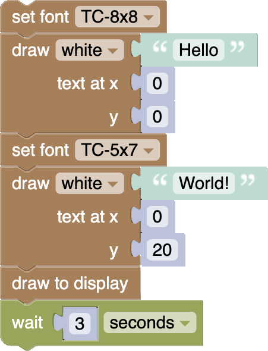
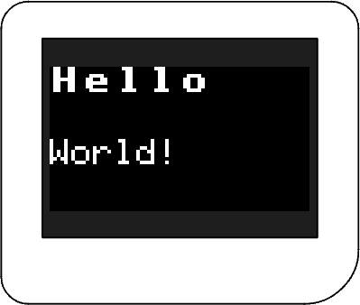
</center>

---

## Font Spacing

Fonts come with gaps between each letter so they are easier to read. These have a default width of 1 pixel. You can change the following block, which can be found in the **Graphics** category to alter the font gap:


Just like with the  block, any  block that runs after the font gap block, will display with the specified font gap width.

See it in action below:

<center>
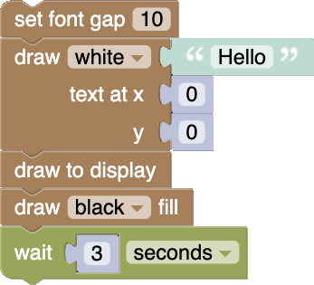
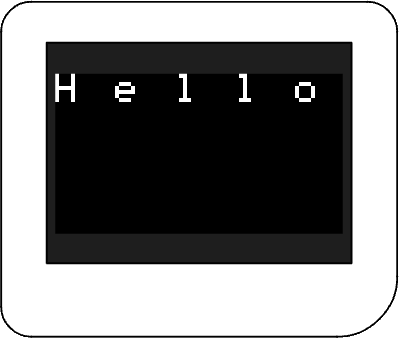
</center>

---

## Making Custom Fonts

You can make your own fonts using sprites made in the **Bitmap Builder**. See the [**Making Sprites Tutorial**](../Making-Sprites/) to see how to make and load sprites.

Font sprites are just sprites that are arranged in a specific way.

Here is an example of a font sprite loaded in the **Bitmap Builder**:

<center>
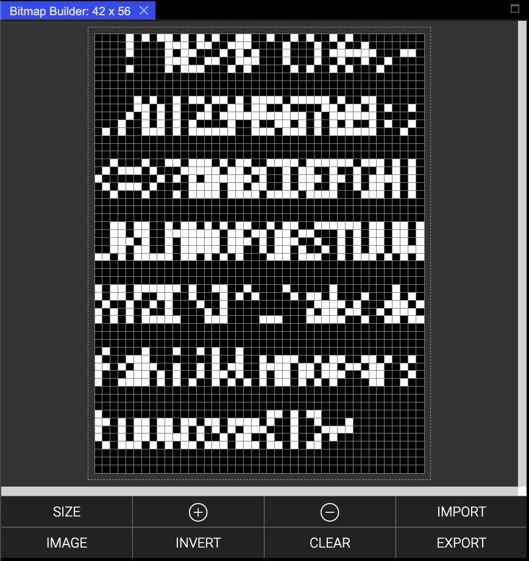
</center>

---

To use a sprite as a font, first you make sure it is loaded into a  block, by selecting the block with your cursor and clicking the **EXPORT** button in the **Bitmap Builder**.

Then you can apply it as the active font using the following block which can be found in the **Graphics** category:


You have to tell that block the width and height of the characters (not of the whole image) in the font, otherwise the Thumby won't know how to extract out the letters, numbers, and symbols correctly! Make sure to **update** the **"width x height"** details where it says **"5 x 7"**.

**⚠ Note**: *If you don't set the width and height of the font characters correctly, the text will come out all garbled!*

See it in action below:

<center>
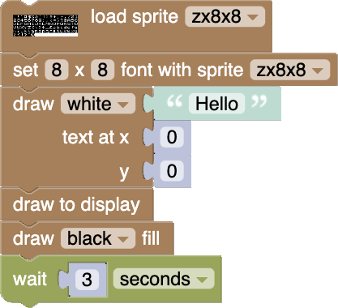
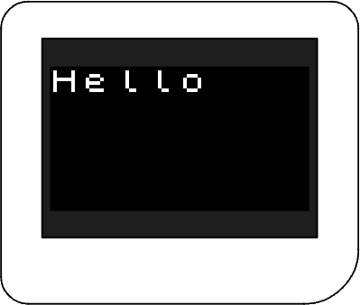
</center>

---

### Font Sprite Structure

Font Sprites must follow a specific structure. All letters, numbers, and symbols must be put into a tightly packed grid of boxes, with each box being the width of the font letters, and the height of every box always being 8.

Fonts that are less than 8 pixels high are drawn at the very top of each box.

Here is an example for a 3x5 Font:

<center>
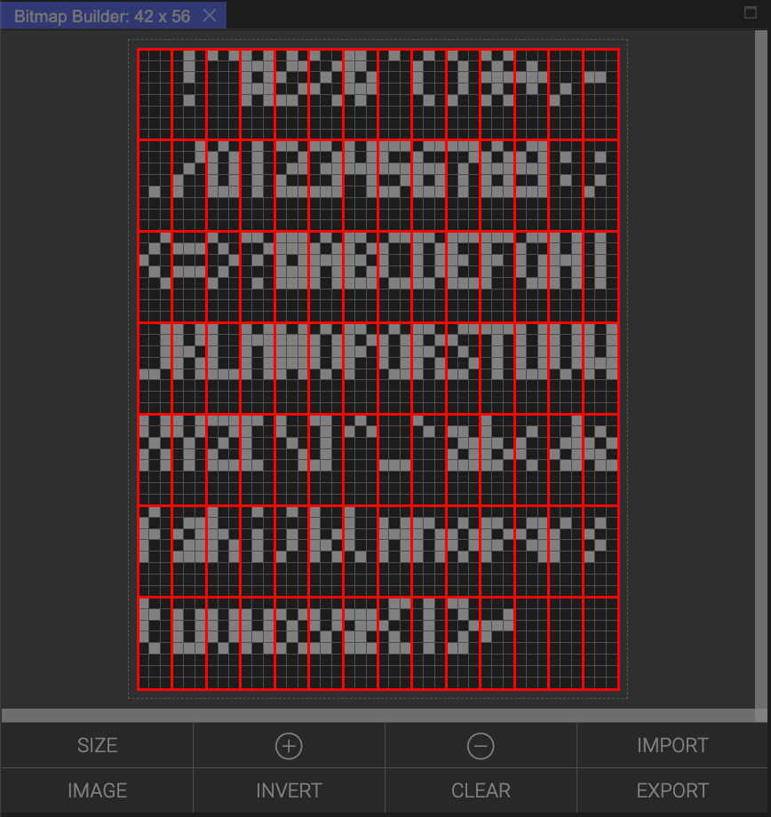
</center>

The order of the letters, numbers, and symbols is very important. They go from right to left and then wrap around underneath, like reading text on a page. The order must always match the following exactly:

```
 !"#$%&'()*+,-./0123456789:;<=>?@ABCDEFGHIJKLMNOPQRSTUVWXYZ[\]^_`abcdefghijklmnopqrstuvwxyz{|}~
```
**⚠ Note**: *This has a* "**space**" *for the first character!*

You don't need to make all of the letters, numbers, or symbols, but leave the box blank instead of removing it.

---

You can actually use fonts to draw pictures or icons! Just make a custom font with each letter representing an icon or game item! Make the font with pictures instead of letters, numbers, or symbols then draw the corresponding text for those icons that you want! You can always switch back to a real font to draw text again.

---

### Example Custom Fonts

Here are some example fonts you can download then open in the Bitmap Builder with the **IMAGE** button, so you can then customise it:

<center>
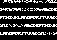
<br>(Community member Auri's teeeny tiny 3x3 font)

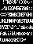
<br>(Tiny Circuit's inbuilt 3x5 font)

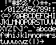
<br>(Tiny Circuit's inbuilt 5x7 font)

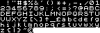
<br>(ZX Spectrum 8x8 font by Mike)
</center>

Don't forget to load it back onto your  block that loads the font for your  block with the **EXPORT** button! And remember to update the font size details!

---

## TinyCalc Example

You can see both examples for switching the default fonts and working with custom fonts in the TinyCalc program from the <a href="https://arcade.thumby.us/" target="_blank" alt="Thumby code editor arcade"**Thumby Arcade**></a> . The full set of blocks can be seen below:

<center>
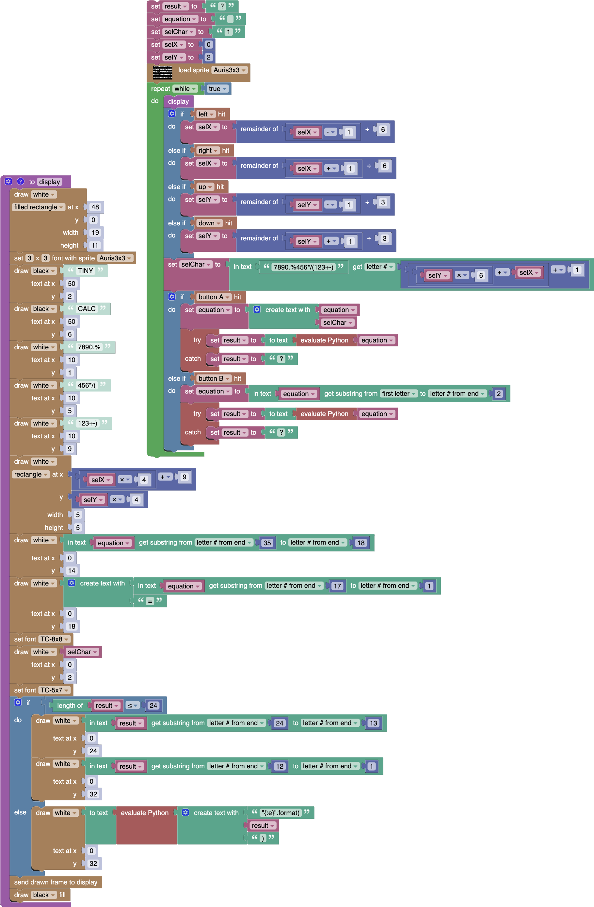
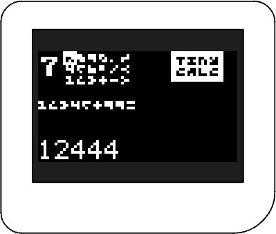
</center>

Try out TinyCalc yourself by [**downloading the blocks here**](../TinyCalc.blocks) and using **IMPORT FROM PC** to select the downloaded file!

As a challenge, try to add wider font spacing gaps between the selectable keypad keys to make them easier to read!

---

**Thanks to:** community member *Auri* for the Auri3x3 font! And also thanks to community member *AyreGuitar* for finding the zx8x8 font!

---

[**Next Tutorial: Saving High Scores**](../Saving-High-Scores/)
