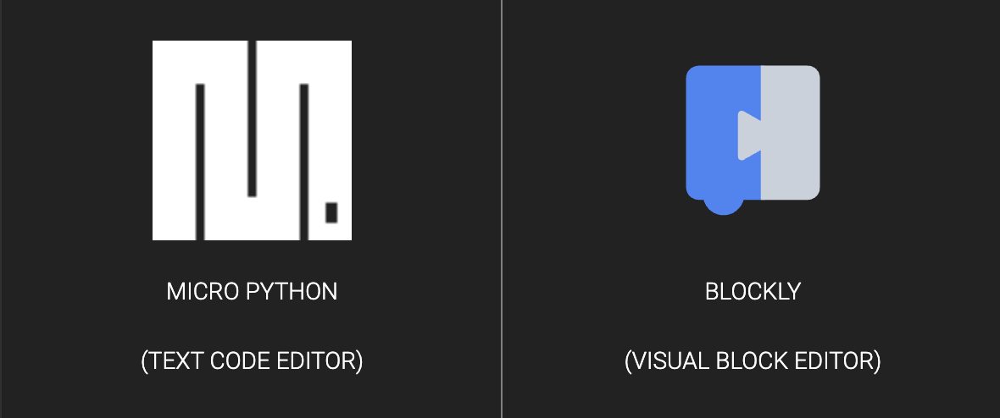
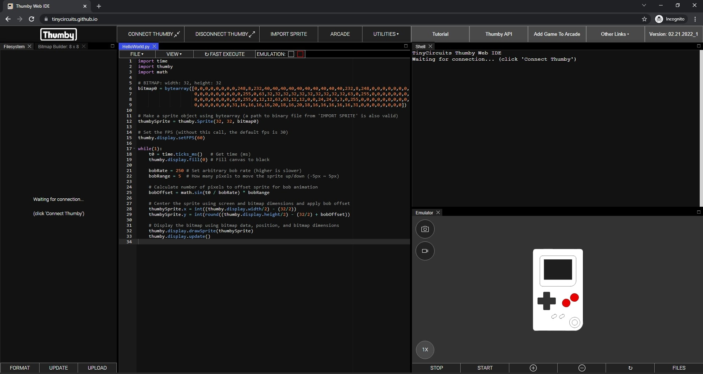
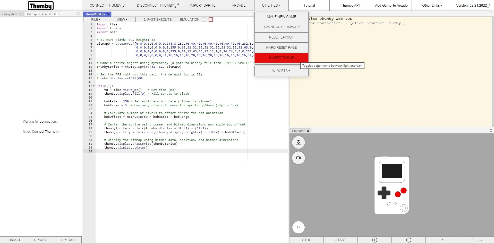
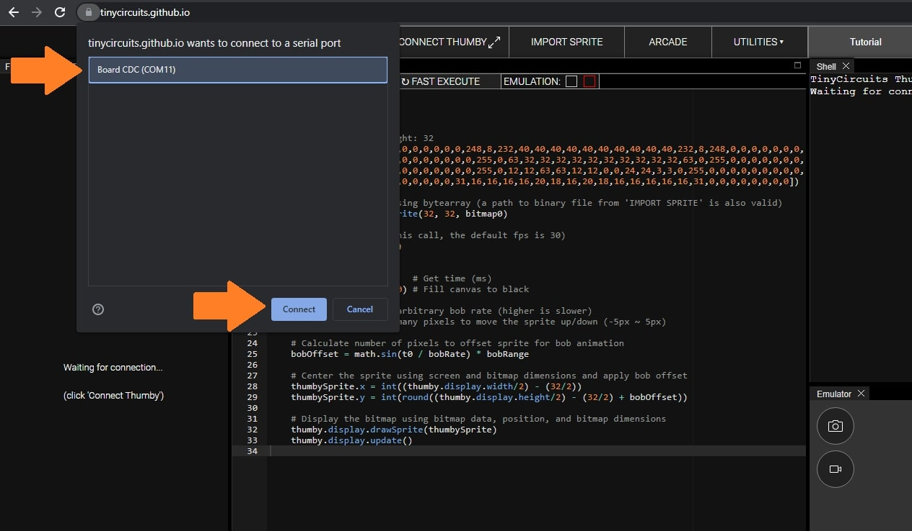
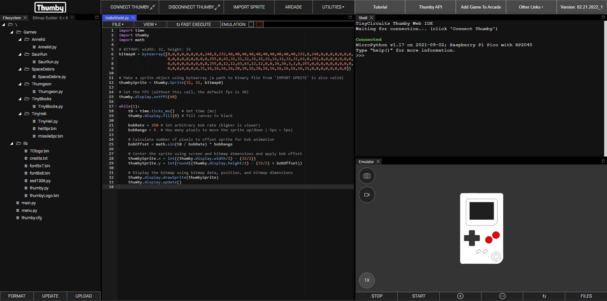
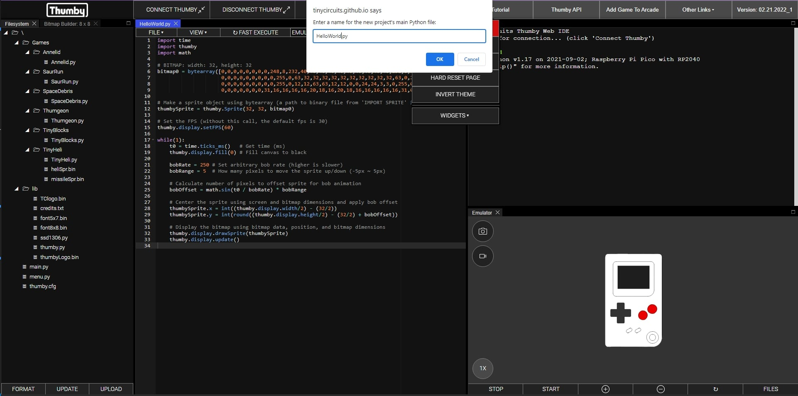
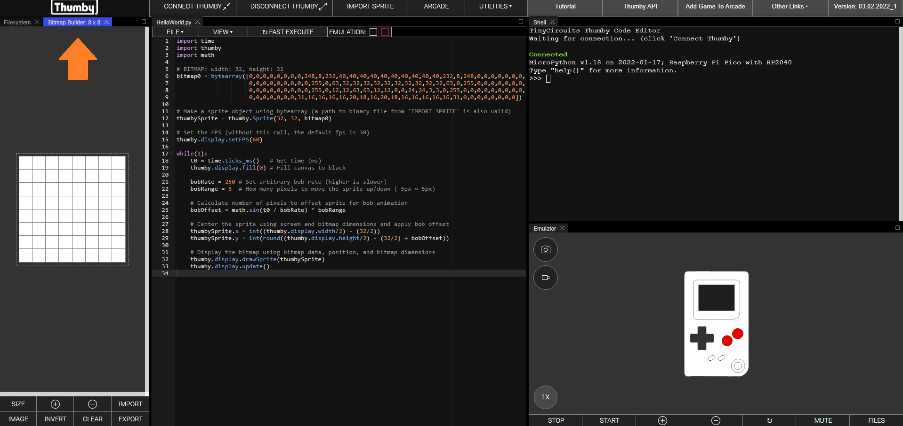
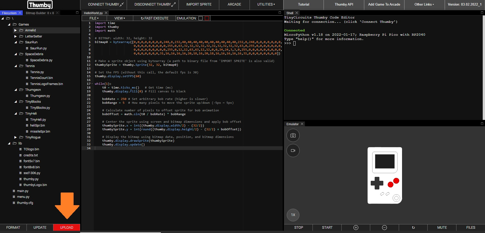

# Thumby Code Editor Documentation

Thumby comes loaded with games, you can turn Thumby on and press the down button on the directional-button-pad to see all the games already on the Thumby. You can <a href="Code-Editor/Arcade-games/" alt="download more free games to thumby">**add more games**</a>, or make your own!

This tutorial will show you how to build a basic project, emulate it, and upload it to your Thumby using our online Code Editor!

Any code written in the Code Editor is saved to your local web storage, so refreshing or closing the Code Editor webpage won't erase your saved work. Use Ctrl+S (or Command+S) to save your programs in the Code Editor. These are the only ways you can lose your progress (*avoid doing these!*):

* Hard resetting the page: Utilities -> Hard Reset Page (the Code Editor will warn you not to do this)
* Clearing your local storage: F12 -> Application -> Local Storage -> Clear
* Exiting the browser tab with code in it without saving (the Code Editor will warn you if you have not saved your most recent edits to Thumby)

*NOTE: The Thumby Code Editor and accompanying tutorials will update as more features are added and as we grow our software support for Thumby. If you are interested in hearing software updates as they happen, [**consider joining our Discord**.](https://discord.gg/vzf3wQXVvm "TinyCircuits Discord Invite Link") Thank you for your support!*

*Tutorial Last updated: February 17th, 2023*

---

## Materials

### Hardware:

*   **[Micro USB Cable](https://tinycircuits.com/collections/accessories/products/micro-usb-cable-3-feet)**
*   <a href="https://tinycircuits.com/products/thumby" target="_blank" alt="Thumby product page">**Thumby**</a>


### Software:

*   <a href="https://code.thumby.us/" target="_blank" alt="TinyCircuits Thumby Web Browser Code Editor page">**TinyCircuits Thumby Web Code Editor**</a> -  *NOTE: Compatible only with [**Google Chrome**](https://www.google.com/chrome/ "Google Chrome Download") or [**Microsoft Edge**](https://www.microsoft.com/en-us/edge "Microsoft Edge Download") web browsers (other browsers not supported)*

---

## Using the Thumby Code Editor

Open Google Chrome or Microsoft Edge, then open the [**online Thumby Code Editor**](https://code.thumby.us/ "Thumby Code Editor") and select **MicroPython** when you see the selection screen:


<center>*Figure 0: Selection between MicroPython or Blockly*</center>

The below screen will appear:


<center>*Figure 1: Screen on opening Thumby Code Editor with MicroPython*</center>

If you prefer a light theme, hover over the 'Utilities' dropdown in the top bar and left-click 'Invert Theme'.


<center>*Figure 2: Light theme*</center>

As you get familiar with the Thumby Code Editor - hover over buttons to get tooltip information on what menus and buttons will do.

---

### Connecting Thumby to the Code Editor:

1\. Turn your Thumby on (switch the top power switch to the right when looking at the screen), and connect it to your PC using a Micro USB Cable

*   _NOTE: Some Micro USB cables only include power and ground wires to power or charge devices - if you are having trouble connecting your Thumby in the following steps, try using a different USB cable. Test the USB cable you are using is able to transfer data by transferring files, like pictures or text files, from a different USB compatible device._

2\. Click 'Connect Thumby' in the top bar

3\. Select the device through the pop-up menu

4\. Click 'Connect'

The below screenshot shows the button locations and order to click them in.  


<center>*Steps 2: Press 'Connect Thumby' button*</center>


<center>*Steps 3 and 4 to connect Thumby*</center>

If connection is successful, a green 'Connected' message will be printed to the terminal - you will also see a hardware icon appear at the right side of the browser tab to show that you are connected to a Serial port. 


<center>*Thumby Connection Screen & Filesystem*</center>

After doing the above connection steps, the Thumby will be paired to the webpage and will auto-connect when 'Connect Thumby' is clicked.

With the Thumby connected it is time to upload some code!

If you're on Linux, your user needs to be added to the `dialout` group. Use this command: 

```
sudo adduser $USER dialout
```

and restart your machine.

---

## The Code - Thumby Games!

Follow the below steps to start a project and then upload it to Thumby.

*   Hover over the 'Utilities' menu and click 'Make New Game ', set the name to anything you like, just be sure to keep the '.py' characters at the end of the file name.


<center>*New game creation*</center>

*   Click 'OK' after typing in a name, in this case, we used: **HelloWorld**

The Thumby **Filesystem** should be preloaded with a 'Games' and 'lib' folder, each containing files. Double left-click any file to open it in a webpage code editor. 'thumby.py' in 'lib' is the main API that should be used to program your projects.

After exploring any of the library or game files, close those editors by left-clicking the 'X' in the respective tab of the editor.

If you close all of the editors, or close out of any of the other Windows like the **Shell** or **Emulator**, you can reopen these windows by going to 'Utilities' -> 'Widgets' -> and then you can add back any window panel options.

---

### Writing Your First Thumby Project

Follow the below steps and enter code as you go to program your first Thumby project.

*   Import the *time* and *math* modules that will be used for animating a sprite with respect to time. Also import the thumby module that implements the main API for interacting with the buttons and the screen

```py
import time
import thumby
import math
```

*   Draw a Sprite using the **Bitmap Builder** panel:


<center>*The **Bitmap Builder** panel*</center>

*   First, set the width and height to 32px by clicking the 'Size' button in the **Bitmap Builder**. Left-click bitmap squares to set pixels to black, and right-click squares to set them white
*   Once the sprite is drawn, select a line in the code editor, then click the 'Export Lines' button in the 'Bitmap Builder' panel - see the below code snippet for the result.
*   Or you can draw a Sprite/Bitmap using a tool like [**GIMP**](https://www.gimp.org/ "Gimp website") - export bitmaps as binary files (.bin) to include in your games.

```py
# BITMAP: width: 32, height: 32
bitmap0 = bytearray([0,0,0,0,0,0,0,0,248,8,232,40,40,40,40,40,40,40,40,40,40,232,8,248,0,0,0,0,0,0,0,
                        0,0,0,0,0,0,0,0,0,255,0,63,32,32,32,32,32,32,32,32,32,32,63,0,255,0,0,0,0,0,0,0,
                        0,0,0,0,0,0,0,0,0,255,0,12,12,63,63,12,12,0,0,24,24,3,3,0,255,0,0,0,0,0,0,0,0,0,
                        0,0,0,0,0,0,0,31,16,16,16,16,20,18,16,20,18,16,16,16,16,16,31,0,0,0,0,0,0,0,0])
```

*   Initialize the sprite object using the width, height, and bytearray object OR binary file location of the sprite:

```py
# Make a sprite object using bytearray (a path to binary file from 'IMPORT SPRITE' is also valid)
thumbySprite = thumby.Sprite(32, 32, bitmap0)
```

*   Set the frame rate of the Thumby game to control how fast the screen changes:

```py
# Set the FPS (without this call, the default fps is 30)
thumby.display.setFPS(60)
```


---


### Adding Game Logic to Move Sprites

*   Create a loop where the sprite will be animated bobbing up and down. The first steps every loop are to store the current time in milliseconds and to clear the screen to black:

```py
while(1):
    t0 = time.ticks_ms()   # Get time (ms)
    thumby.display.fill(0) # Fill canvas to black
```
*   As time goes on create a vertical offset using the sin function. The offset will move the sprite up and down 5px.

```py
    bobRate = 250 # Set arbitrary bob rate (higher is slower)
    bobRange = 5  # How many pixels to move the sprite up/down (-5px ~ 5px)

    # Calculate number of pixels to offset sprite for bob animation
    bobOffset = math.sin(t0 / bobRate) * bobRange
```
*   Next, use the Thumby screen width and the width of the bitmap to center and calculate the sprite's X and Y location

```py
    # Center the sprite using screen and bitmap dimensions and apply bob offset
    thumbySprite.x = int((thumby.display.width/2) - (32/2))
    thumbySprite.y = int(round((thumby.display.height/2) - (32/2) + bobOffset))
```
*   The sprite is drawn on the screen, every loop, using the bitmap data array, the sprite X & Y position, and the sprite dimensions

```py
    # Display the bitmap using bitmap data, position, and bitmap dimensions
    thumby.display.drawSprite(thumbySprite)
    thumby.display.update()
```

That's it! You can emulate the project in the web browser by selection the red checkbox of the 'Emulation:' option in the **Text Editor**. Then press the 'Start' button in the **Emulator** window.


---


### Adding Your Game to Thumby

For your project to show up on the Thumby game select screen, there needs to be one .py file with the same name as the project. Before clicking upload, the webpage and code should look something like the below image:


<center>*Setup before clicking 'Upload'*</center>

Now click the 'Upload' button on the bottom of the Filesystem panel, disconnect Thumby, power cycle it (turn off and on), use down on the Thumby d-pad to find your project, click the left button to select and execute your main project file.

If the above code was used, the below animation will play after selecting 'HelloWorld' in the Thumby select screen:

<center></center>

---

## Other Web Code Editor Features

*   Execute a single file on the Thumby at root level '/' using the 'Fast Execute' button in any code editor
*   Import/export a .py file from/to your computer using the file drop-down in any editor (left-click 'File')
*   Change the font size of individual editors using the view drop down (left-click 'View')
*   Delete files or directories on the Thumby by left-clicking in the **Filesystem** panel
*   Open files stored in Thumby by right-clicking in **Filesystem** panel
*   Reset page layout by re-positioning each panel using button under 'Utilities' -> 'Reset Layout'
*   Reset and erase all page memory using button under Utilities -> 'Hard Reset Page'
*   'Clear' and 'Invert' buttons in the **bitmap builder** panel
*   Import exported lines to bitmap builder by selecting bitmap array and comment then left-clicking
*   Download most compatible/tested Thumby MicroPython firmware through 'Utilities' -> 'Download Firmware' button and follow instructions provided when hovering over 'Download Firmware' button
*   All work is automatically saved to the webpage, nothing is lost on a page refresh

---

